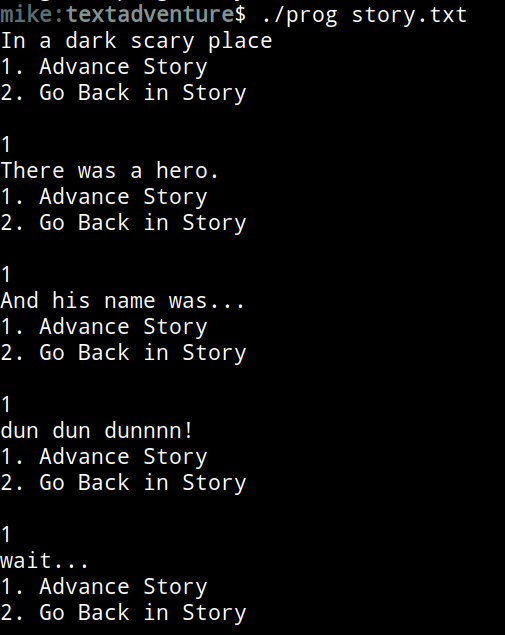

# Story Time

> "Let's begin our adventure!"

# Resources to help

Some additional resources to help you through this assignment

| C++ related links                                   | Description                       |
| --------------------------------------------------  | --------------------------------- |
| [My C++ Youtube Series](https://www.youtube.com/playlist?list=PLvv0ScY6vfd8j-tlhYVPYgiIyXduu6m-L) | My video series playlist for learning C++ |
| [cppreference](https://en.cppreference.com/w/)      | Definitive, more encyclopedic guide to C++ (less beginner focused, but excellent technically) |
| [cplusplus.com](http://www.cplusplus.com)           | Nice website with examples and tutorials geared more for beginners, reference has lots of examples, and the tutorial page is a great starting point |
| [learncpp.com](https://www.learncpp.com/)           | Handy page for learning C++ in tutorial form   |

| SDL2 related links                                    | Description                       |
| --------------------------------------------------    | --------------------------------- |
| [SDL API Wiki](https://wiki.libsdl.org/APIByCategory) | Useful guide to all things SDL2   |
| [My SDL2 Youtube Playlist](https://www.youtube.com/playlist?list=PLvv0ScY6vfd-p1gSnbQhY7vMe2rng0IL0) | My Guide for using SDL2 in video form.   |
| [Lazy Foo](http://lazyfoo.net/tutorials/SDL/)         | Great page with written tutorials for learning SDL2. Helpful setup tutorials for each platform. |
| [Lazy Foo - Handling Key Presses](https://lazyfoo.net/tutorials/SDL/04_key_presses/index.php) | Useful tutorial for learning how to handle key presses | 

# Description

### Task 1 - Text Adeventure

In this lesson, you are going to create a very small text adventure narrative to practice the C++ that you have learned. The requirements are that you have a 'game loop' that handles 'input', 'update', and 'render' to display a linear narrative (you can go forward and backwards).

The point of this is to see how we can create a 'data-oriented' program (using text as input), as well as to get started programming in C++.

The journey that you create, however, is up to you!

### Assignment strategy

My suggested strategy for this assignment is to complete part 0 and part 1 first to help you get more comfortable with C++.

## How to compile and run your program

1. Your solution should compile using `g++ *.cpp -o prog` 
	- We should then be able to run your program given a text input file: `./prog story.txt`

# Submission/Deliverables

### Submission

- Commit all of your files to github, including any additional files you create.
- Do not commit any binary files unless told to do so.
- Do not commit any 'data' files generated when executing a binary.

### Deliverables

* You need to commit your code to this repository **and** a story.txt file.

# F.A.Q. (Instructor Anticipated Questions)

* Q: Can I expand on my story and the options?
  * A: Sure, have as much fun with it as you like!

# Found a bug?

If you found a mistake (big or small, including spelling mistakes) in this lab, kindly send me an e-mail. It is not seen as nitpicky, but appreciated! (Or rather, future generations of students will appreciate it!)

- Fun fact: The famous computer scientist Donald Knuth would pay folks one $2.56 for errors in his published works. [[source](https://en.wikipedia.org/wiki/Knuth_reward_check)]
- Unfortunately, there is no monetary reward in this course :)

# Going Further

- Try having the text print out one character at a time.
- Consider adding other attributtes and classes to make things more interactive like an acttual text adventure. That said, we're expecting this assignment to be relatively small :)
