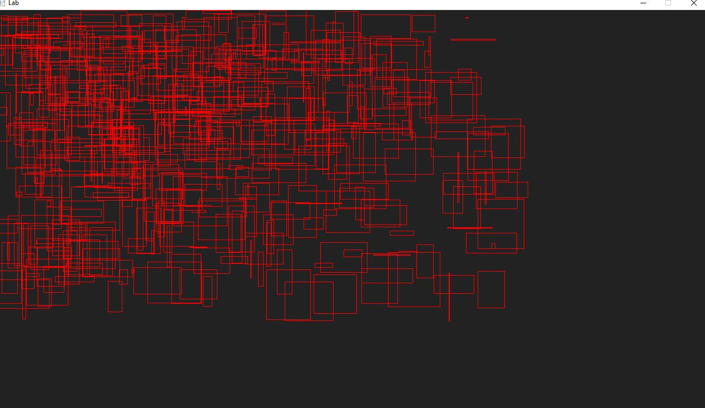

# Frame Capping

> We are going to get a main loop setup, and take a first peek at SDL.

## Task 0 - Git

As a reminder, you are going to use Git to submit your assignments on github.com.
[Git in 23 minutes](https://www.youtube.com/watch?v=PgNTp71sl0I).

Roughly speaking, here is how to use 'git' if you have not previously:

1. Run `git clone your_repository_url` to establish a git repository on your system. *your_repository_url* is found by clicking the 'green' button on you Monorepo homepage(move one directory up from this folder).
	i. It should look something like `https://github.com/CourseName/Monorepo-yourname.git`
2. When you make a change to a file within this directory you can see what is different by:
	i. run `git status` to see what you have changed locally on your computer. Changes you have made locally have not yet been saved to github's servers. 
3. When you are happy with your changes do `git add whatever_file.c` which prepares that specific file to be added to the master. [[git add documentation](https://git-scm.com/docs/git-add)]
4. Next, you will do `git commit -m "some informative message about your changes"` to record changes in your repository [[git-commit documentation](https://git-scm.com/docs/git-commit)]
5. Finally, do a `git push` to actually make things happen--meaning everything you have added will go to the github server. You can check your github.com repository to see exactly what I will see. [[git push documentation](https://git-scm.com/docs/git-push)]

## Task 1 - (Reading ~2 minutes) - Simple DirectMedia Layer (SDL)

SDL("Simple DirectMedia Layer") is a library that allows us to draw a window to the screen. We will be using SDL version 2.0+ for this course. SDL itself is an abstraction layer that can create windows for the appropriate platform(i.e. Windows, Mac, Linux, mobile, etc.), without us have to do the real nitty gritty details of setting up a window.

## Task 2 - Setting up your Environment with SDL

Below you will find some instructions for setting up SDL for your respective operating system. When you are finished, all you should have to do is run `python3 build.py` in your terminal, run `./lab`, and a red window should pop up.

- **Click on the following link** below and follow the directions to get SDL setup and installed.
    - [Lazy Foo](http://lazyfoo.net/tutorials/SDL/01_hello_SDL/index.php) 
- **If** the above link does not work, I have some video tutorials on setting up SDL below.
    - Note: You can ignore the installation of 'glad' and 'opengl' in the setup.
    - [Linux SDL Setup](https://www.youtube.com/watch?v=P3_xhDIP7bc&list=PLvv0ScY6vfd-p1gSnbQhY7vMe2rng0IL0&index=3)
    - [Mac SDL Setup](https://www.youtube.com/watch?v=V6ACATpl2LQ&list=PLvv0ScY6vfd-p1gSnbQhY7vMe2rng0IL0&index=4)
    - [Windows mingw](https://www.youtube.com/watch?v=DQ-NBjBFLJ4&list=PLvv0ScY6vfd-p1gSnbQhY7vMe2rng0IL0&index=3)
        - Note: I prefer windows users follow this setup.
    - [Windows Visual Studio](https://www.youtube.com/watch?v=tL838EuDraw&list=PLvv0ScY6vfd-p1gSnbQhY7vMe2rng0IL0&index=5)
        - Note: This is not 'VS Code' the text editor, this is the full IDE Visual Studio.
        - [Another example with visual studio](https://www.youtube.com/watch?v=nZbytgAhvoY&list=PLvv0ScY6vfd-p1gSnbQhY7vMe2rng0IL0&index=6)

**As long as** you are able to get your application compiling, and can run with `python3 build.py` in a terminal you are all set. Note, if you use visual studio, then that is fine, but mak

### Still having trouble?

Try these options respectively for your platform

* Linux:
    * [Linux](http://www.mshah.io/comp/Spring18/graphics/Lab/1/linux.html) (Tested on Ubuntu)
* Windows
  * Option 1: 
    * Download mysys from here: https://drive.google.com/file/d/116IIh7n8aoWXKDiQeonZjxXEkPPh3RME/view?usp=sharing
        * unzip the contents to a location on your machine.
        * From mysys64 launch the mingw64 terminal(a blue icon).
            * Note, you may have to navigate to the assignment folder wherever you have cloned this repo. (e.g. cd /c/Users)
        * Try running the build script with `python3 build.py` and then execute lab.exe from within mysys
  * Option 2: 
    * [MinGW 64](http://www.mshah.io/comp/Spring18/graphics/Lab/1/MinGW.html) (Tested on Windows 10)
      * These are some more scattered instructions on installation.
  * Option 3: (Least preferred)
      * Use visual studio here: http://www.mshah.io/comp/Spring18/graphics/Lab/1/windows.html
* [Mac](http://www.mshah.io/comp/Spring18/graphics/Lab/1/mac.html) (Tested on High Sierra 10.13.2 Operating System)
    * Something else? Let your instructor know. Typically labs and assignments are tested on all three configurations above (though in the future there will be 1 set of directions to follow after you are setup!)

## Task 3 - Frame Capping

For this portion of the assignment. I have abstracted some of the SDL initialization components so that our 'main.cpp' is quite small. In fact, you will find a key member function 'loop' that serves as our infinitely running game loop. Take some time to look at this frame work.

### The support code

Provided in the support code is a game loop with a moving object. The object moves at a fixed speed that the developers have thought to originally be good on their system.

There is one problem however. The game was developed on a very specific machine, that had a very specific clock rate. Depending on what hardware you are running on, the object will be moving at different speeds! This is an especially common problem for Desktop and mobile game development (It was less of a problem for old SNES games, where you knew the CPU frequency and that could be relied upon).

* **Your goal is to**:
  * Output the frames per second (This can be to the console, the screen, or the title bar, any option is fine)
  * Set the frames per second to be capped at 60 FPS
  
Good luck!

### Compiling and running the support code

* Linux, Mac, and Windows (Mysys)
  * Type: `python3 build.py`
  * Then : `./lab` or `./lab.exe`

**Note**: I have also included a `./build.sh` file you can also try that should generate a binary for you

## Task 4 - SDL Abstraction

*TODO* Question: Is the SDL abstraction in your opinion good? What could be improved? You may discuss with others in the class or on piazza if you like. 

Answer: 

1. I think SDL abstraction is widely used and well-established. The abstraction conform to the programming habits of programmers. But there is one aspect can be approved, SDL's memory management is relatively simple, and some developers may prefer more advanced memory management tools and techniques.

## Helpful Resources

Some additional resources to help you through this assignment

- My SDL Playlist
	- https://www.youtube.com/playlist?list=PLvv0ScY6vfd-p1gSnbQhY7vMe2rng0IL0
- http://lazyfoo.net/tutorials/SDL/23_advanced_timers/index.php
- http://lazyfoo.net/tutorials/SDL/24_calculating_frame_rate/index.php
- http://lazyfoo.net/tutorials/SDL/25_capping_frame_rate/index.php
- Chaning Window Title
  - https://wiki.libsdl.org/SDL_SetWindowTitle

## Deliverables

- Implementing frame capping at 60 FPS (Note, depending on rounding errors it may show up at 61 FPS or 59 FPS -- that's fine))
- Complete Task 4 by critiquing the SDL abstraction.

## Going Further

What is that, you finished Early? Did you enjoy this lab? Here are some (optional) ways to further this assignment.

- If you want to know how to setup a window in your native operating system platform the long way (without using a library like SDL), here are some examples from the web: [Linux](https://stackoverflow.com/questions/15091514/how-do-i-create-a-window-in-opengl-on-linux-instead-of-using-glut), [Linux X11](https://www.opengl.org/discussion_boards/showthread.php/177999-GCC-OpenGL-without-glut?p=1239444&viewfull=1#post1239444), [Graphics Context in Mac](https://developer.apple.com/library/content/documentation/GraphicsImaging/Conceptual/drawingwithquartz2d/dq_context/dq_context.html#//apple_ref/doc/uid/TP30001066-CH203-CJBDCHAC), [Native Windows](http://www.falloutsoftware.com/tutorials/gl/gl2.htm)
  - (Note: It is always worth knowing how things work behind the scenes! In doing so however, you may further appreciate the work done by SDL for us!)
- We are not going to spend time arguing if other libraires (glut, freeglut, glfw, etc.) are the better or the best.
  - Try the one that fits your need
  - I choose SDL2 because it is what modern commercial games use, it is free, and it supports many desktop environments (as well as mobile if you are interested!)

## Found a bug?

If you found a mistake (big or small, including spelling mistakes) in this lab, kindly send me an e-mail. It is not seen as nitpicky, but appreciated! (Or rather, future generations of students will appreciate it!)

- Fun fact: The famous computer scientist Donald Knuth would pay folks one $2.56 for errors in his published works. [[source](https://en.wikipedia.org/wiki/Knuth_reward_check)]
- Unfortunately, there is no monetary reward in this course :)

