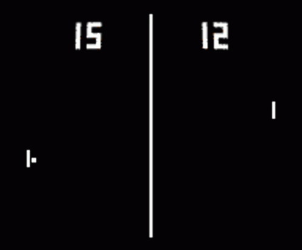

# Part 1

> For this assignment you are going to create a basic version of pong!

## Task 1 - Pong

Let me take you back in time to one of the earliest games--[pong](https://en.wikipedia.org/wiki/Pong). Pong is a table-tennis game where two paddles move up and down and send a ball back in forth. It is largely credited as the first commercially successful game. And if you can believe it, you can probably make the hit game in one sitting! This will be our first game project in the course!

## Pong Requirements

The requirements overall are loose, but we should see a working implementation of pong using SDL.

1. There should be two paddles that move (either left-to-right or top-to-bottom depending on your perspective)
	- Using the arrowkeys to move one paddle, and WASD for the other.
	- (If you'd like to implement an A.I. for one of the paddles, you may do so)
2. There should be at least one ball that can collide with a paddle and be sent the opposite direction.
3. Your game should be frame capped to 60 Frames per second.
4. The first player to score 3 points wins, and the game should reset.
	- A message in the console or on the screen should indicate that a player has won or lost.
    - The score can then reset automatically
5. You may otherwise get as creative as you like
	- (i.e. Sound, images, or other assets are not required)

You are free to use this excellent resource below as inspiration for building a pong clone. 

**Key Resource** https://austinmorlan.com/posts/pong_clone/

I have an additional code walk of my implementation here: https://www.youtube.com/watch?v=Ze9wxVDbbrA&t=1s -- though I think it will be less useful with all of my abstraction.

### Pong Learning Objectives

My objective for providing you this implementation is:

1. I want you working in C++ and SDL2
2. I want you building the game with a game loop and considering good abstractions
    - i.e. I recommend using object-oriented paradigms you have learned (which this tutorial shows some examples of).
3. You can probably find many implementations of pong, and I think it's a good thing to try to implement for our second game.

## Helpful Resources

Some additional resources to help you through this lab assignment

- http://lazyfoo.net/tutorials/SDL/ 
	- This is the page where I learned how to setup SDL. 
	- Part of this lab is inspired by this websites tutorial.
- My SDL Playlist
    - https://www.youtube.com/playlist?list=PLvv0ScY6vfd-p1gSnbQhY7vMe2rng0IL0
- https://www.learncpp.com/
	- Useful resource for learning C++
- http://www.cplusplus.com/
	- Useful reference and tutorial for learning C++

## Deliverables

- Implement pong.
	- We should be able to run `python3 build.py` and execute the **lab** executable to see the working SDL application plays the game 'pong'.
	
- Note: I have also provided a `./build.sh` which you can run your application in.

## Going Further

What is that, you finished Early? Did you enjoy this assignment/lab? Here are some (optional) ways to further this assignment.

- Check out some more SDL tutorials, add more paddles, look into adding sound, add a main menu, etc. :)

## Found a bug?

If you found a mistake (big or small, including spelling mistakes) in this lab, kindly send me an e-mail. It is not seen as nitpicky, but appreciated! (Or rather, future generations of students will appreciate it!)

- Fun fact: The famous computer scientist Donald Knuth would pay folks one $2.56 for errors in his published works. [[source](https://en.wikipedia.org/wiki/Knuth_reward_check)]
- Unfortunately, there is no monetary reward in this course :)
