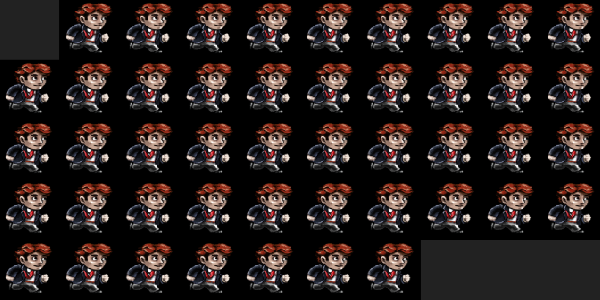

# Resource Manager



> A resource manager to support sprite animations.

## Logistics

You will be working on your own laptop today modifying files in the [./src](./src) and [./include](./include) directory

## Task 1 - Resource Manager

Your goal for this assignment is to implement a `ResourceManager` as a singleton class. The resource managers job is to manage all of the assets that you load into your game engine, whether they are sound files, image files, 3D files, or configuration files. For the purpose of this assignment, you will only be loading bitmap 'image' files for the use of an animated sprite sheet.

### Resource Manager Structure

The recommended implementation is to implment a [Singleton](https://en.wikipedia.org/wiki/Singleton_pattern) Class for your resource manager. Note that you are provided a Resource Manager in your labs starter code, though you will have to refactor it to be a Singleton, such that you can use the Resource Manager anywhere you load an SDL_Surface or SDL_Texture for instance. An example refactoring to make your ResourceManager a Singleton is shown below, and you may make additional modifications so that it handles the loading of 'image/texture' resources loaded from SDL.

```cpp
// #include <....> // Decide what data structures you need

// This is an example Resource Manager
// You can use this as a template for implementing your own.

class ResourceManager{
  private:
    ResourceManager();  // Private Singleton
    ResourceManager(ResourceManger const&); // Avoid copy constructor
    void operator=(ResourceManager const&); // Don't allow assignment.
    
    // ... // perhaps other private members
    // Consider the data type that you may need to store
    // your resources
    
  public:
  
  static ResourceManager &GetInstance();
  
  void LoadResource(std::string image_filename);
  
  SDL_Surface* GetResource(std::string key);
  
  // 'equivalent' to our constructor
  int StartUp();
  
  // 'equivalent' to our destructor
  int ShutDown();
  
  // ... Perhaps other public functions?
  // *Hint you need at least one other one for the datatype you are supporting*
}:
```
* Note: It is strongly recommended you read the [Singleton Chapter of Game Programming Patterns](https://gameprogrammingpatterns.com/singleton.html) textbook to understand the implementation and the trade offs of this design pattern.
* Provided is a supplemental video on Singleton Classes: [Design Patterns - Singleton Pattern | Explanation and Implementation in C++](https://www.youtube.com/watch?v=eLAvry56vLU&list=PLvv0ScY6vfd9wBflF0f6ynlDQuaeKYzyc&index=3)


### Additional notes on the support code

For this assignment I have provided a good chunk of support code go get you started. There are going to be 50 images that are loaded in your code (the number 50 is somewaht arbitrary, but illustrates the point that a game may load many images). The **problem is that** we are very inefficiently loading 50 of the same bitmap images, and allocating 50 of the same textures. This is incredibly wasteful from a resources perspective! So again, every time we call SDL_Surface, when we already have those pixels in memory, that is a wasteful operation.

Think about how you might refactor your code to load resources utilizing your resource manager. You may make any additional changes to the code. The key is to make sure exactly 1 copy of the image is loaded. Think about what data structures may be useful.

In order for us to more easily verify the resource manager is working **please print** what the resource manager is doing (e.g. "Creating new resource filename.bmp", "Found Resource filename.bmp utilizing previously loaded resource")

## Task 2 - Resource Manager Design

After finishing your resource manager, your next task will be to think about some other resource pipelines in graphics and games framework by completing the following exercise.

**Please read and edit** in the [exercise.md](./exercise.md) file your answer.

### Compiling and running the support code

* Linux, Mac, and Windows (Mysys)
  * Type: `python3 build.py`
  * Then : `./lab` (Linux and Mac) or `./lab.exe` (for windows users)
  
Note: As a shortcut you can run `python3 build.py && ./lab`. If there are no compilation errors, your program will immediately execute, thus saving you a few extra seconds of typing.  

## Bonus Assets

If you'd like to use some more interesting animated sprites, these may be worth taking a look.

* Free Resources
	* itch.io
		* [https://itch.io/game-assets/free](https://itch.io/game-assets/free)
	* [red-hood-character](https://legnops.itch.io/red-hood-character)
	* [Animated Pixel Hero](https://rvros.itch.io/animated-pixel-hero)

## Helpful Resources

Some additional resources to help you through this lab assignment

1. My Video on the Singleton Pattern
	- [Design Patterns - Singleton Pattern | Explanation and Implementation in C++](https://youtu.be/eLAvry56vLU)
2. My series on C++ Programming
	- https://www.youtube.com/playlist?list=PLvv0ScY6vfd8j-tlhYVPYgiIyXduu6m-L
2. Useful C++ Data Structure(s)
  - [std::map series of tutorials](https://thispointer.com/stdmap-tutorial-part-1-usage-detail-with-examples/)
  - [Somewhat trustworthy discussion on map vs unordered map on stack overflow](https://stackoverflow.com/questions/2196995/is-there-any-advantage-of-using-map-over-unordered-map-in-case-of-trivial-keys)
3. Resources on Resource Managers
  - [Tutorial 15: ResourceManager, TextureCache!](https://www.youtube.com/watch?v=HBpmfrQINlo)
  - [A Resource Manager for Game Assets](https://www.gamedev.net/articles/programming/general-and-gameplay-programming/a-resource-manager-for-game-assets-r3807/)
  - [Adding a Resource Management Class](http://eangogamedevelopment.blogspot.com/2017/01/part-21-completing-game-menu.html)

## Deliverables

- Task 1 - A singleton class for a resource manager.
  - Note: Your singleton should support the ability to load 'multiple' images, and not just the one provided.
  - Note: Please leave some SDL_Log messages to indicate that the image is only loaded once.
- Task 2 - Answer the questions in the [exercise.md](./exercise.md)

## Going Further

What is that, you finished Early? Did you enjoy this lab? Here are some (optional) ways to further this assignment.

- Try using smart pointers. I would probably recommend the shared_ptr for your resource manager if you are creating lots of dynamic resources. This will make sure your resources are automatically cleaned up when there are no references.
	- That said, shared_ptr has some performance issues if you are creating lots of objects, and then prefer instead unique_ptr.
- Animate all of the frames of the character and build on the system to handle different animations.
	- Currently I've hard coded the values for brevity.
- Consider making a 'global resource manager' type of class.
	- This global resource manager can be a singleton, and then contain individual instances of resource manager.
	- This may be a cleaner design, in that we only then would have one singleton in our game engine. The trade-off is that a global resource managaer composed of several other resource maangers starts to have lots of indirection (though the use of pointers) that may impact performance. We thus need to carefully consider the performance needs of our game versus our comfort level in some cases as developers.

## Found a bug?

If you found a mistake (big or small, including spelling mistakes) in this lab, kindly send me an e-mail. It is not seen as nitpicky, but appreciated! (Or rather, future generations of students will appreciate it!)

- Fun fact: The famous computer scientist Donald Knuth would pay folks one $2.56 for errors in his published works. [[source](https://en.wikipedia.org/wiki/Knuth_reward_check)]
- Unfortunately, there is no monetary reward in this course :)
