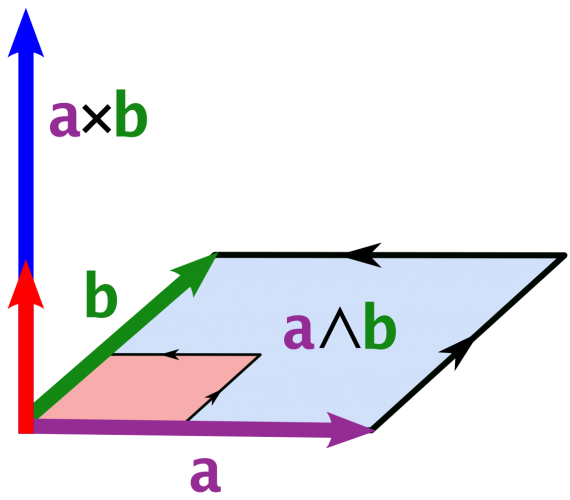

# TinyMath.hpp

## Part 1 - Designing a Library in C++ (TinyMath.hpp)



> Games are math

## Implementing TinyMath.hpp

In the code repository, you will see the function prototypes for the [./include/TinyMath.hpp](./include/TinyMath.hpp) library. Understanding the fundamentals of math is important for games, and the exercise of building a library will help you practice your C++. The good news is that you only really need to implement a good math library once (Unless math changes...in which case we have bigger problems!).

For this lab you have some flexibility if you want to add more functions or organize it in a different way. This is your personal math library that you can take advantage of in the course.

### Task 1 - Implementaiton

Implement the functions in [./include/TinyMath.hpp](./include/TinyMath.hpp) (They should be marked "TODO").

#### Requirements for your implementation

1. You may not use loops in your code.
2. Do not change the function signatures (i.e. don't rename any functions or change the arguments)

### Task 2 - Testing TinyMath.hpp

A unit test is a standalone test that checks for the correctness of a specific use case in your code. In our case, we are testing if we have a working math library implementation. 

Included is a [build_tests.py](./build_tests.py) has been modified to compile a second executable based off of the unit tests in the [tests](./tests) directory to run a series of unit tests.

```cpp
// Add a 1-vector with a 0-vector.
bool unitTest1(){
  Vec2D a(1,1);
  Vec2D b(0,0);
  Vec2D result = a + b;
 
  if(result.x == 1 && result.y == 1){
    return true;
  }
    return false;
}
```

Include at least 12 unit tests (i.e. within [/tests/tests.cpp](./tests/tests.cpp)) to convince yourself the math works. You may write simple unit tests like the above. You should try to cover as many of the functions that you write in the library in your unit tests. This is what we will run to ensure that your library is working.

### Compiling and running the support code

* Execute Tests
  * Linux, Mac, and Windows (Mysys)
    * Type: `python build_tests.py`
    * Then : `./prog_unittest` or `./prog_unittest.exe` (for windows users)
* Executable
  * Linux, Mac, and Windows (Mysys)
    * Type: `python build.py`
    * Then : `./lab` or `./lab.exe` (for windows users)
  
## Helpful Resources

Some additional resources to help you through this lab assignment

- [Handy Course on Vector and Matrix Math](http://chortle.ccsu.edu/vectorlessons/vectorIndex.html#10)
- [Dot Product better explained](https://betterexplained.com/articles/vector-calculus-understanding-the-dot-product/)

## Going Further

What is that, you finished Early? Did you enjoy this lab? Here are some (optional) ways to further this assignment.

- Consider reading some more about the design of a math library: https://www.reedbeta.com/blog/on-vector-math-libraries/
- Implement the functions with the AVX commands if you like. I have included 5 heavily commented AVX samples to get you started.
- Implement more functions you think may be of use!
- Implement Vector2D and Matrix4D
- Change all of your classes and structures into templates.
  - [C++ Templates Tutorial](http://www.cplusplus.com/doc/oldtutorial/templates/)

## Found a bug?

If you found a mistake (big or small, including spelling mistakes) in this lab, kindly send me an e-mail. It is not seen as nitpicky, but appreciated! (Or rather, future generations of students will appreciate it!)

- Fun fact: The famous computer scientist Donald Knuth would pay folks one $2.56 for errors in his published works. [[source](https://en.wikipedia.org/wiki/Knuth_reward_check)]
- Unfortunately, there is no monetary reward in this course :)
