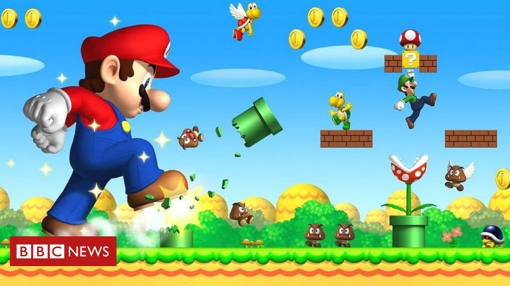

# Exercise

- Exercise 1 -- list some of the components that you think are associated with some of the game objects you see in the following screenshot. You should be able to identify **at least 3** individual 'components' that make up the 'game objects' shown.
  - Remember that components are things that could be added to GameObjects, such that they can change or add behavior to that particular game object.
    -  For reference, you may look at other Game Engines like Unity3D for inspiration: https://docs.unity3d.com/Manual/Components.html

1. The transform component which will have the position, rotation and scale parameter.
2. A component about object's mass and his gravity related parameters.
3. A script component which control the object's state, collide and movement.
4. A render component set the object's render function.
5. *edit your response*
