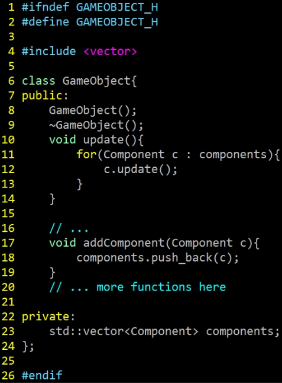

# Abstraction: 2D Game Engine, GameObject, and Components

> "Allow a single entity to span multiple domains without coupling the domains to each other." Component Programming Pattern  - Robert Nystrom

## Introduction

Today we are discussing the [component game programming pattern](https://gameprogrammingpatterns.com/component.html)  to 'decouple' classes and make our games more maintainable (**Please read the chapter** it's very insightful!). 

Typically when we write Object-Oriented Code it can be tempting to create large inheritence structures like what is shown in the figure below. This can quickly become difficult software to maintain and to optimize for performance (Note in the diagram below 'EvilTrees' becomes ambiguous in where it belongs, and if we inherit from two differnt paths, we get the 'deadly diamond inheritance' problem).

>Diagram from: https://www.gamedev.net/tutorials/_/technical/game-programming/understanding-component-entity-systems-r3013/ (The one aspect I do like is the separation of 'static' and 'dynamic' however--that may be useful for optimization purposes of which components change or do not change)

So typically we favor using composition within our game objects, where game objects use a container data structure(e.g. a std::vector<Component>) to hold different components which in effect create a new type of game object based on the combinations of components held and their associated data. Using composition is also much more friendly in regards to *Data-Oriented Design*.

>Diagram from: https://www.gamedev.net/tutorials/_/technical/game-programming/understanding-component-entity-systems-r3013/ (This is a much more 'flat' hierarchy and allows us even more flexibility in how we create our entities. Note: We are likely to have a 'init','update','render' or associated member functions with each component.)

## Task 1 - GameObject (a.k.a GameEntity or GameActor) 

The GameObject class (sometimes also known as the GameEntity or GameActor class) is one of the most common custom data types for abstracting objects in 2D and 3D games. This class is typically what you will be building your game from, alongside a more general 'component' class.

### Your Task

The **overall goal** is to be able to move the 'main' character left and right with the arrowkeys or 'a' and 'd' keys. 

You are going to do this by creating a 'GameObject' class for the main character, and then add components to that character to achieve the above goal. 

1. **I don't care** how you do this, so long as you have a GameObject class with a list or vector of components that can be added to it to achieve the functionality. 
2. You can modify the code however you like.

Here is my recommendation and what is provided in the starter code:

1. Implement the interface and implementation of a [GameObject.hpp](./include/GameObject.hpp) and [GameObject.cpp](./src/GameObject.cpp) to implement a Game Object.
2. Implement the interface and implementation of a [Component.hpp](./include/Component.hpp) and [Component.cpp](./src/Component.cpp) which will serve as a 'base' class to derive new components.
3. Implement the interface and implementation of [TransformComponent.hpp](./include/TransformComponent.hpp) and [TransformComponent.cpp](./src/TransformComponent.cpp) which is derived from [Component.hpp](./include/Component.hpp).
4. Implement the interface and implementation of [ControllerComponent.hpp](./include/ControllerComponent.hpp) and [ControllerComponent.cpp](./src/ControllerComponent.cpp) which is derived from [Component.hpp](./include/Component.hpp).
5. Refactor 'Sprite' as 'SpriteComponent'  that inherits from 'Component' class.
6. Refactor 'TileMap' as 'TileMapComponent' that inherits from 'Component' class.
7. Within 'Engine' class, store a `std::vector<GameObject> m_gameobjects`. You could then iterates through all `m_gameobjects` within the `Engine::Render` and `Engine::Update` functions.
  - (For now in Engine::Start, you would then create each GameObject for the TileMap and Character)

## Compiling and running the support code

* Linux, Mac, and Windows (Mysys)
  * Type: `python3 build.py`
  * Then : `./lab` or `./lab.exe` (for windows users)
* You can generate the documentation for the project by running `doxygen doxygen.txt` 

## Helpful Resources

Some additional resources to help you through this lab assignment

- [https://gameprogrammingpatterns.com/component.html](https://gameprogrammingpatterns.com/component.html)
  - Essential Reading -- The component programming pattern 
- [Creating the GameObject Class](https://www.youtube.com/watch?v=jzasDqPmtPI&list=PLhfAbcv9cehhkG7ZQK0nfIGJC_C-wSLrx&index=5) 
  - Looks like a helpful C++/SDL2 tutorial on building Game objects.

## Deliverables

1. Implement a GameObject, Component, and any associated components such that I can move the character left and right with the arrowkeys or 'a' and 'd' keys.

# F.A.Q. (Instructor Anticipated Questions)

* Q: Do I have to incorporate my previous resource manager and tiny math?
  * A: No. For now I am including those as the 'default' files that are essentially not implemented. It may be nice for you to add your code so you can progressively build out your codebase, but it is not strictly a requirement nor something to burden yourself with now if it will take a lot of time.

## Going Further

What is that, you finished Early? Did you enjoy this lab? Here are some (optional) ways to further this assignment.

- N/A (Implement features and functionality in your actual project!)

## Found a bug?

If you found a mistake (big or small, including spelling mistakes) in this lab, kindly send me an e-mail. It is not seen as nitpicky, but appreciated! (Or rather, future generations of students will appreciate it!)

- Fun fact: The famous computer scientist Donald Knuth would pay folks one $2.56 for errors in his published works. [[source](https://en.wikipedia.org/wiki/Knuth_reward_check)]
- Unfortunately, there is no monetary reward in this course :)
